## Introduction
The purpose of this article is to teach users how to use Adobe Sign.

### How to Login to Adobe Sign

1. Go to https://acrobat.adobe.com/us/en/sign.html and click on “Sign In”

   

2. Input your CSUN email address

   
 
3. After you input your CSUN email address, click on the password field

   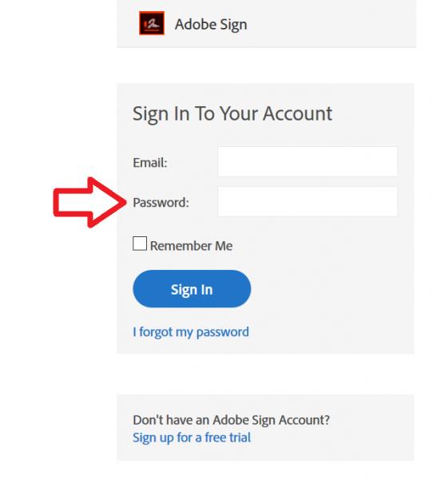

4. You will be taken to another screen that will ask you to select an account. Select “Company or School Account”

   

5. You will be taken to the CSUN login page. Input your CSUN Credentials to login to Adobe Sign

   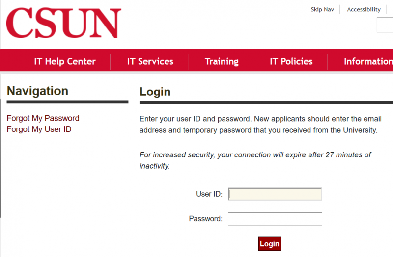
   
6. You are now logged in to Adobe Sign.

   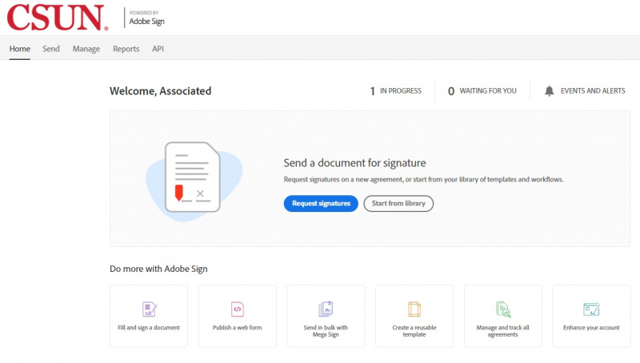
   
### How to Create and Send a Document

1. Click "Send" at the top of the page or click on "Request Signatures"
   
   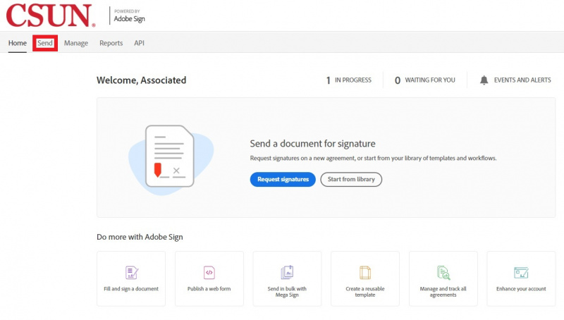
   
   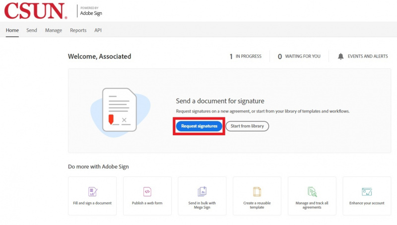

2. You will be taken to this page to begin creating your document

   

3. Input the recipient you want to send the document to. NOTE: You can’t send a document to yourself to sign

   

4. Name the document. The document should be “ASI-[Department Name]-[Name of document]”

   

5. Add the file that needs to be signed. Make sure “Preview and Add Signature Fields” is checked off. This will allow you to add signature fields in the next section

   

6. Once the document is processed, you will be redirected to this page to preview and add Signature Fields

   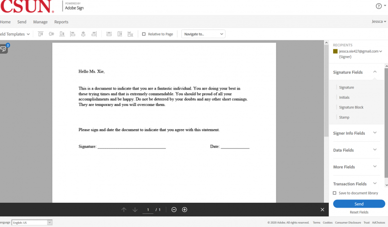

7. To add a signature field, click “Signature” and drag it into the document

   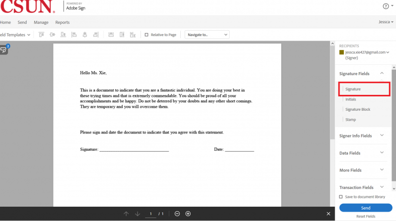

8. The document should look like this with the Signature Field

   

9. Click on the Signature Field to double check that the field is assigned to the correct individual

   

10. Click “Send” to send the document. NOTE: Once the document is sent, it can’t be changed

   

11. You will be redirected to this page to indicate that the document has been successfully created and sent

   

### How to Use Fill & Sign
The purpose of this section is to show users how to upload a document or form to sign. The end result will be a PDF document that can be used to send to other users.
1. Click the "Fill and sign a document" icon at the bottom of the page

   

2. You will be taken to this page to create your document

   

3. Add the file that needs to be signed

   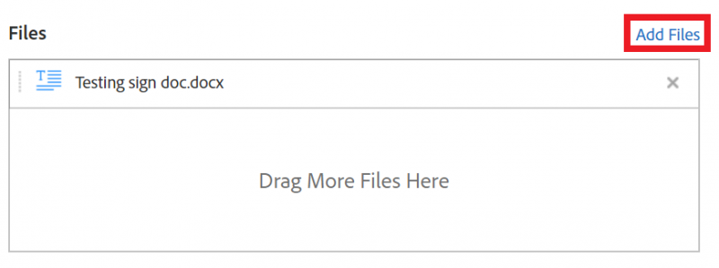

4. Name the agreement. The document should be “ASI-Department Name-Name of document” Click “Next” to process the document

   

5. Once the document has been processed, you will be taken to this page

   

6. Click “Sign” to select a signature or initial to use for the document

   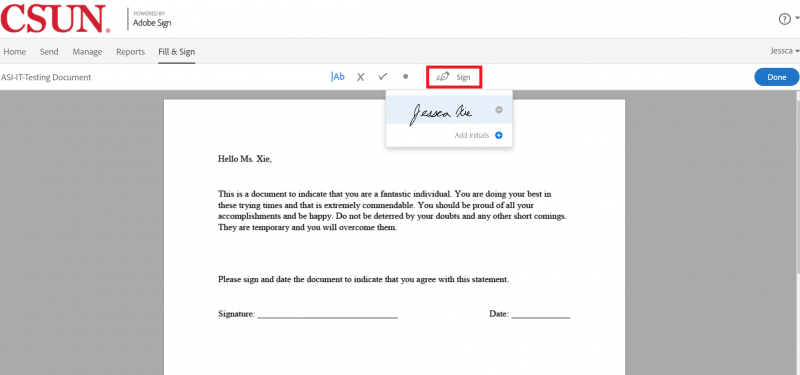

7. Click on your signature and drag it into the document. Move the signature to where the document needs to be signed

   

8. Click “Done” to complete the document. NOTE: Once the document is completed, it can’t be changed

   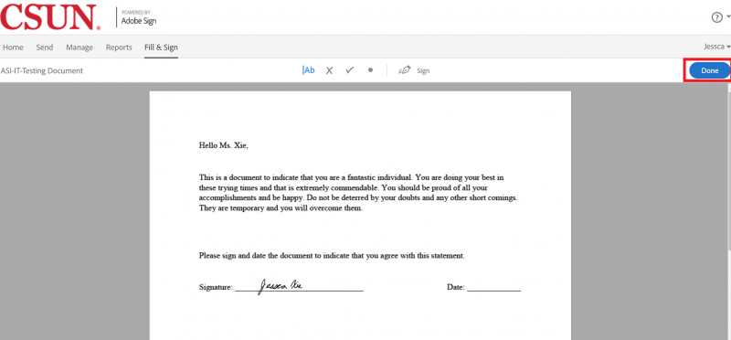

9. Once the document is processed, you will be redirected to this page to indicate that the document has been successfully created and signed.

   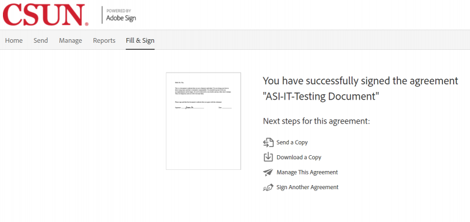

10. To access the completed document, it can be downloaded from this page. Another alternative is to find the document in the "Manage Tab" at the top of the screen.

   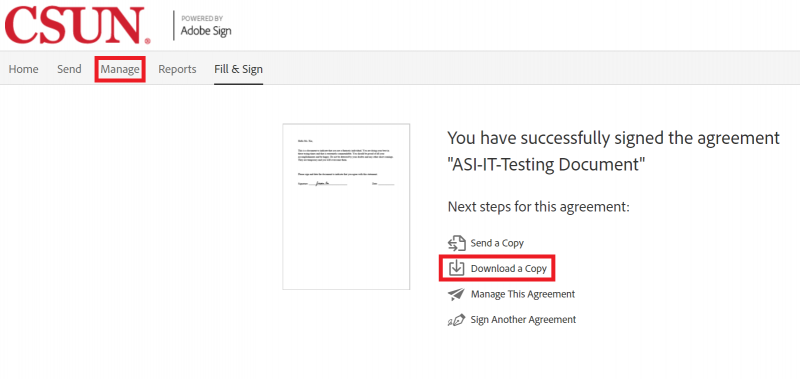

