## Introduction
{: .no_toc }
This Wiki goes over some common issues with AS' HP printers and how to resolve them. It also includes some tips that we found to be helpful with using the printers.

---

## Table of Contents
{: .no_toc .text-delta }

1. TOC
{:toc}

---

## Scanning Double-Sided Documents
Scanning double-sided documents allows you to scan both sides of a sheet of paper and have them be in the same PDF. There are two ways to scan double-sided documents. The first is using the Automatic Document Feeder (ADF). The ADF works only with loose-leaf paper. The second is using the flatbed scanner, which is generally reserved for scans that will not fit through the ADF (such as pages from a textbook).

The following printers are capable of scanning double-sided documents automatically (meaning, you don't have to scan one side, flip the paper over yourself, and scan the other side).
	-Accounting 576
	-Athletic Training 576
	-Central 6040
	-Childrens' Center 576
	-Childrens' Center 6040
	-Government 525
	-Outdoor Adventures 525
	-Recycling 525

### Using the ADF

These instructions were created using a 525 as an example. The 6040 is a similar process.
1. Load your documents into the ADF on the top of the printer. Please note that the ADF pulls pages from the top of the stack down, so the first page of your document should be on top of the stack, and the last page on the bottom of the stack.
2. Tap the "Save to Network Folder" icon.

	

3. Tap the "Quick Set" for your department's scan folder. It will turn dark gray when selected.

	

4. Tap the radio button for your department's folder path. It will also turn dark gray when selected.

	

5. Tap the "next page" arrow at the bottom-center of the screen.

	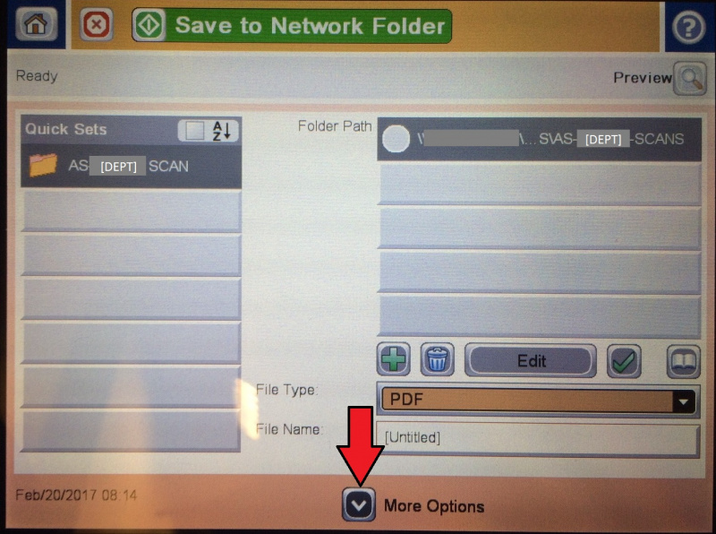

6. Note how the preview has the number "1" (circled in red). This indicates that the scanner is currently set to scan single-sided. We will change that to scan double-sided. To do so, tap the "Original Sides" option.

	

7. Tap the radio button next to "2-Sided".

	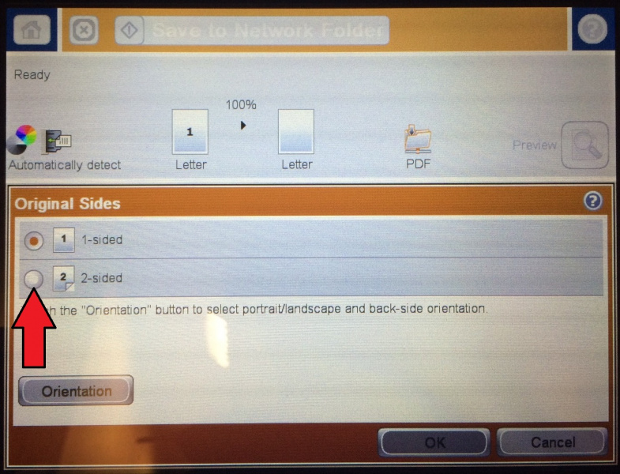

8. Note how the preview now has the number "2" (circled in red). This indicates that the scanner is now set to scan double-sided. Tap "OK"

	

9. Verify that the preview now has the number "2", and that "Original Sides" is now set to "2-sided", with a black triangle marker. Tap "Save to Network Folder".

	

10. Wait while the scanner connects to the scans drive.

	

11. Wait while the scanner scans your documents. Your documents will make 3 passes, as the ADF will scan the first side, pull the document back, flip it over, scan the second side, and place it in the output tray.

	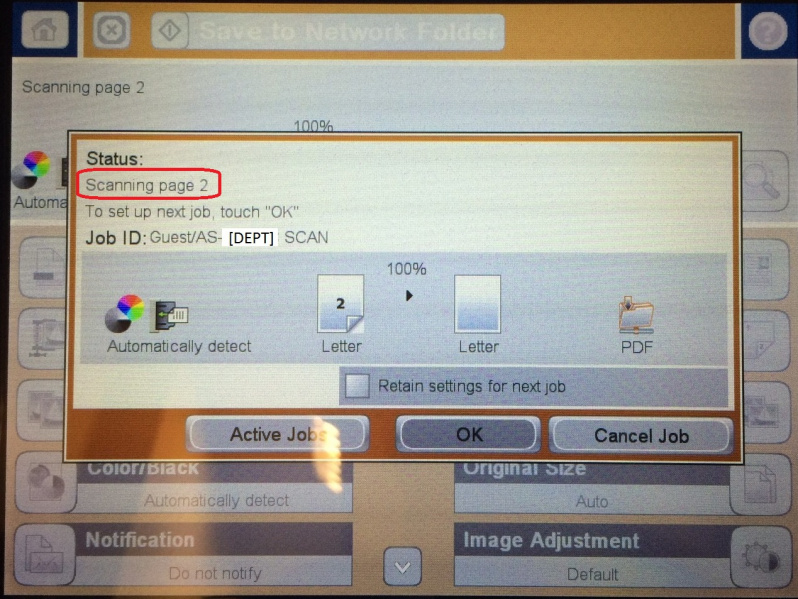

12. Once you see "success" (circled in red), tap OK.

	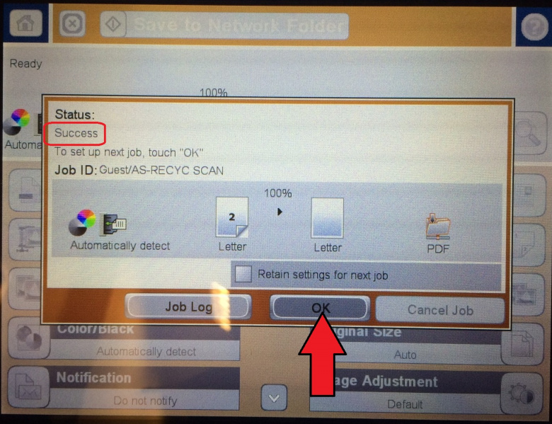

**Using the Flatbed**
The flatbed will use a feature called the "Job Build" function. The job build function tells the scanner to pause after scanning a single page. It will then wait until you tap "Scan" to scan the next page. This gives you time to remove the first page from the flatbed, prepare the next page, place it on the flatbed, and scan it. Once the last page is scanned, then the printer will combine all of your scans into a single PDF.

This Job Build method also works with the ADF. However, it is highly recommended to use the automatic double-sided scanning described in Using the ADF above. If your documents fit in the ADF, this Job Build method serves no benefit as it takes much more time for the same result.

1. Load your first document onto the flatbed glass.

2. Tap the "Save to Network Folder" icon.

	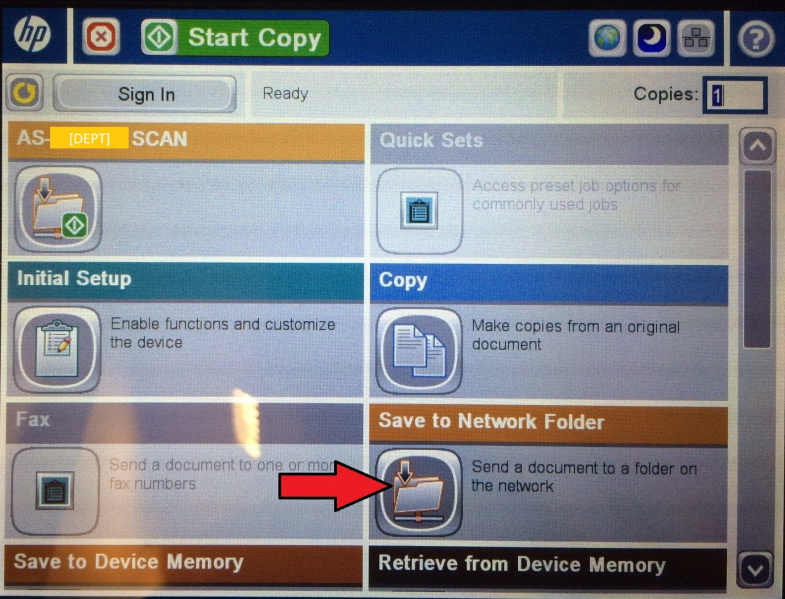

3. Tap the "Quick Set" for your department's scan folder. It will turn dark gray when selected.

	

4. Tap the radio button for your department's folder path. It will also turn dark gray when selected.

	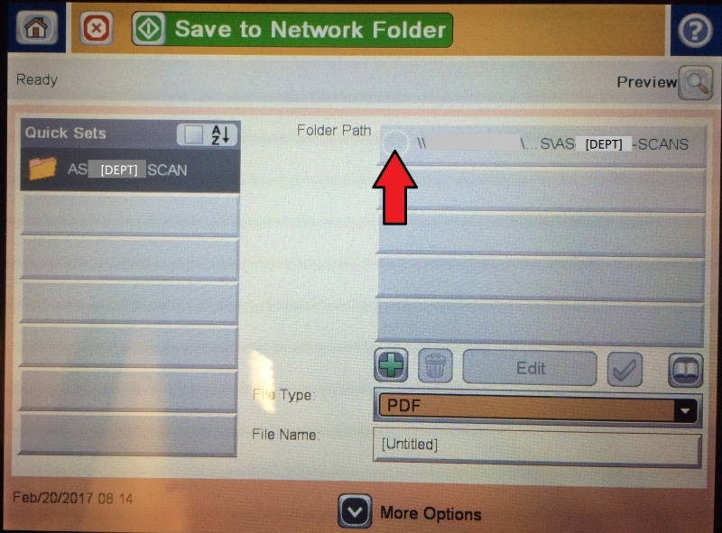

5. Tap the "next page" arrow at the bottom-center of the screen.

	

6. You should now be on page 2 of 3 (circled in red). Tap the "next page" arrow to move to page 3 of 3.

	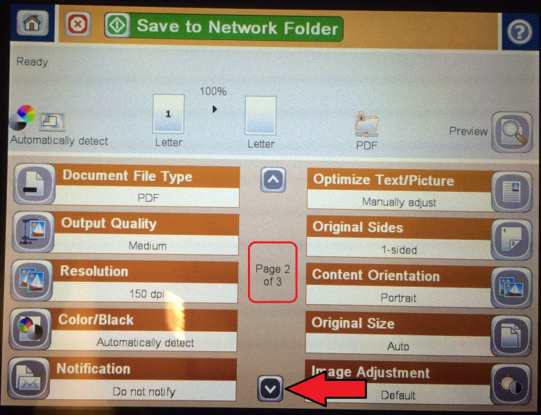

7. You should now be on page 3 of 3 (circled in red). Tap the "Job Build" option.

	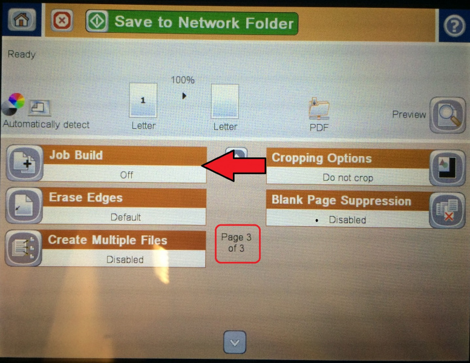

8. Notice how the preview has a single sheet with a number "1" (circled in red). This indicates that the scanner is currently configured to scan a single side of a sheet for the entire job. We will change that to scan multiple sheets with pauses between each sheet. To do so, tap the radio button next to Job Build on.

	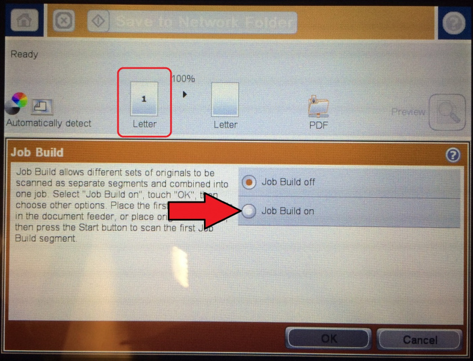

9. Notice how the preview has changed to two sheets with a "+" between them (circled in red). This indicates that the scanner is now set to scan multiple sheets with pauses between each sheet. Tap "OK".

	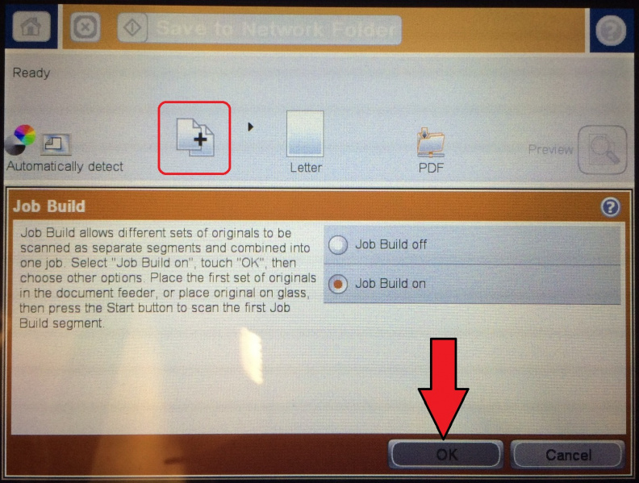

10. Verify that the preview shows two sheets with a "+" between them (circled in red). Tap "Save to Network Folder".

	

11. Wait while the scanner connects to the scans drive.

	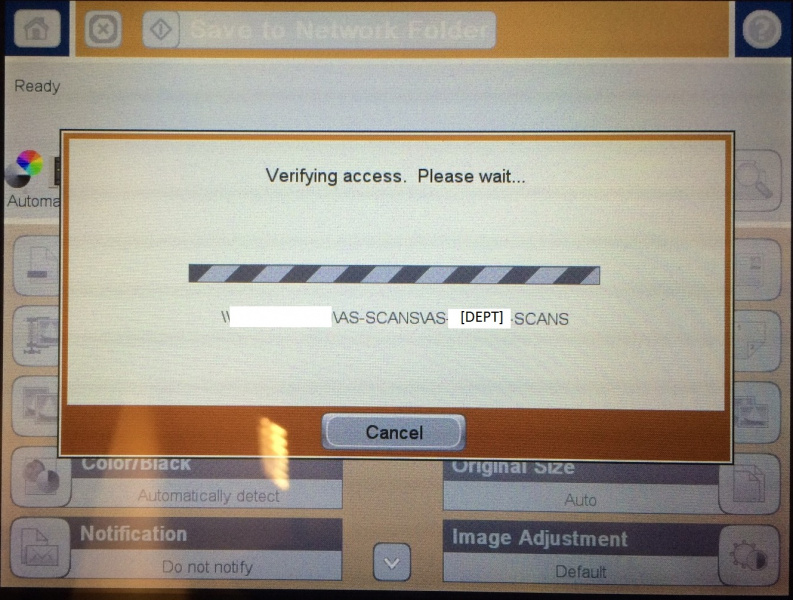

12. The scanner will then say "ready" then say "scanning page 1".

	
	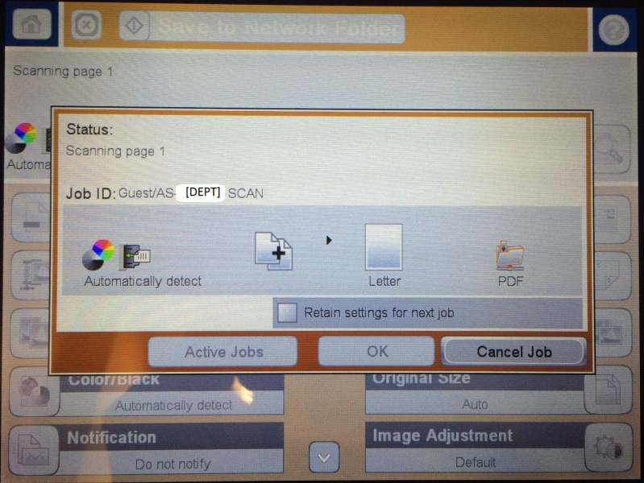

13. The scanner will pause after the first scan. Get your next page positioned on the flatbed glass and tap "Scan".

	

14. The scanner will now say "scanning page 2". Wait while it scans your next page.

	

15. The scanner will pause again after page 2. If you have additional pages to scan, get your next page positioned on the flatbed glass and tap "Scan" (circled in blue), and repeat steps 12-13 as necessary. If this is your last page, tap "Finish" (circled in green).

	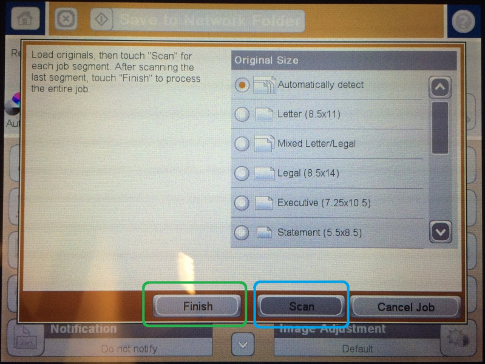

16. Wait while the scanner sends your job to the Scans drive.

	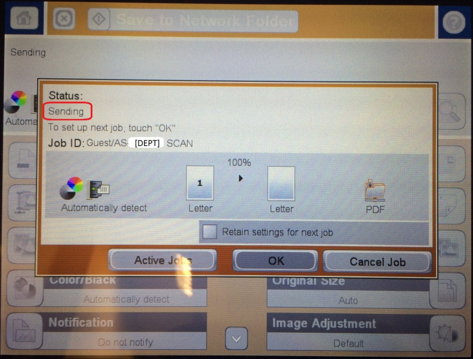

17. Once you see "Success" (circled in red), tap "OK".

	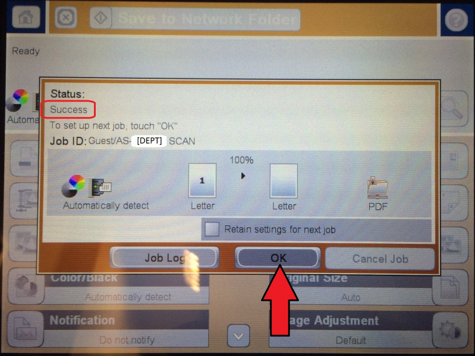

