## Introduction
---------------
The purpose of this article is to document helpful tips that we've come across or have been asked about with using Outlook 2016 for Windows.

## Creating a New Contacts Folder
-----------------
Follow the steps below to create a new folder in your Contacts list.

1. Open Outlook and click on your Contacts.

	

2. Right-click any of your existing folders under "My Contacts" and click "New Folder".

	

3. Give your folder a name. Make sure the "Folder Contains" is set to "Contact Items". Make sure that "Contacts" is selected under "Select where to place folder". Then click "OK".

	

## Exporting Contacts to a CSV
-------------------------------
This is the easiest method that we've found to share a list of contacts with someone else, or back it up for safe keeping.
1. Open Outlook and click on the "File" tab.

	

2. Click on "Open & Export"

	

3. Click on "Import/Export"

	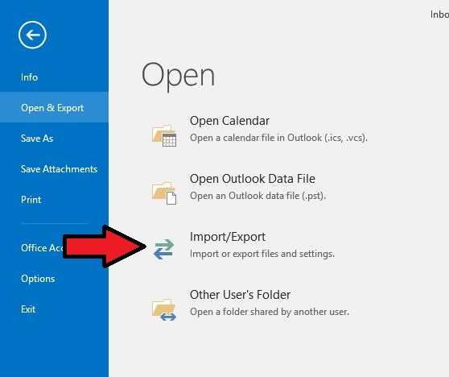

4. Click on "Export to a file" then click "Next"

	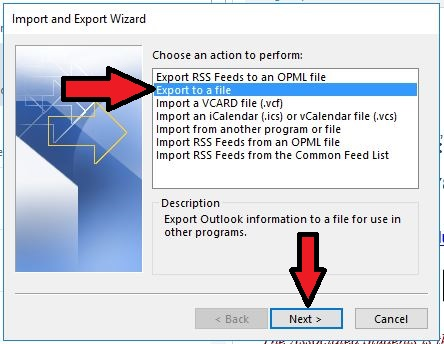

5. Click on "Comma Separated Values" then click "Next"

	

6. Select the contact group that you want to export, then click "Next"

	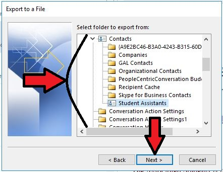

7. Click "Browse" and select the location that you want to save your file to. Then click "next".

	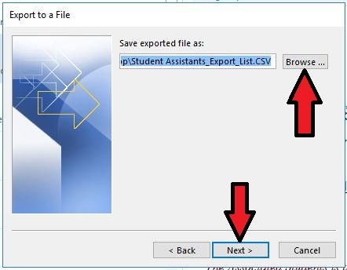

8. Click "Finish".

	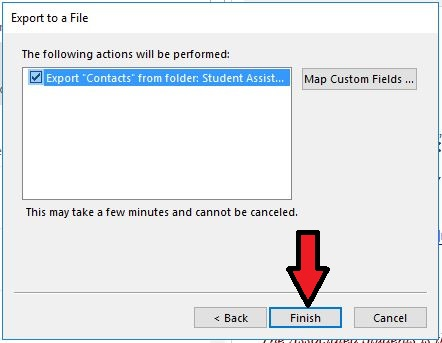

## Importing Contacts from a CSV
------------------
This is dependent on the CSV being created by Outlook using the steps above.

1. Open Outlook and click the "File" tab

	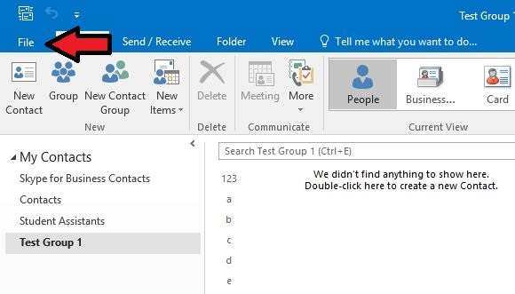

2. Click on "Open & Export"

	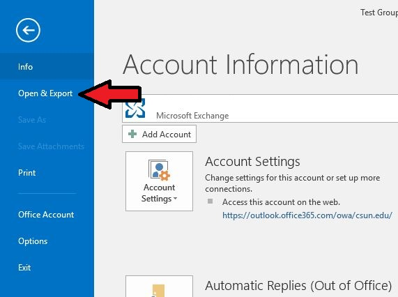

3. Click on "Import/Export"

	

4. Click on "Import from another program or file" then click "Next"

	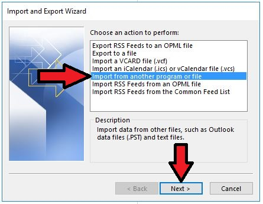

5. Click on "Comma Separated Values" then click "Next"

	

6. Click "browse", and find and select your CSV file. Under "Options", select whichever option you prefer. Then click "Next". NOTE: your CSV file *cannot* be open in Excel or another program, otherwise Outlook will give an error when it tries to import it.

	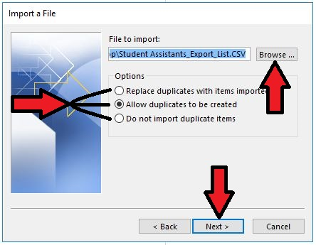

7. Select the contacts folder that you want to import your contacts into. Then click "Next".

	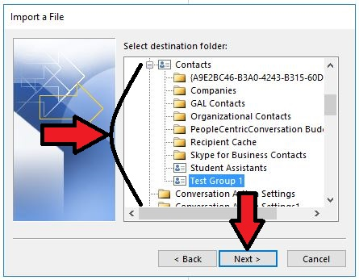	

8. Click "Finish" and wait for your contacts to import.

	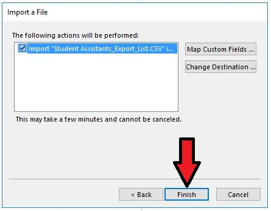

## Updating Your Email Signature
------------------------------
Your email signature is specific to the email application that you use. For example, if you use the desktop version of Microsoft Outlook 2016 (accessed via the Start Menu), then your signature will "live" only in that application. If you were to open Microsoft Outlook Web Access (OWA) through a web browser, then your signature will not be there.

To add or change your signature, follow the appropriate guide below.

*Via Microsoft Outlook 2016 (Desktop Outlook)*

1. Open Outlook and click on the "File" tab.

	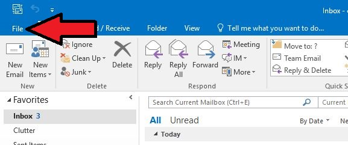

2. Click on "Options".

	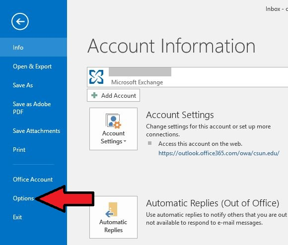

3. Click on "Mail".

	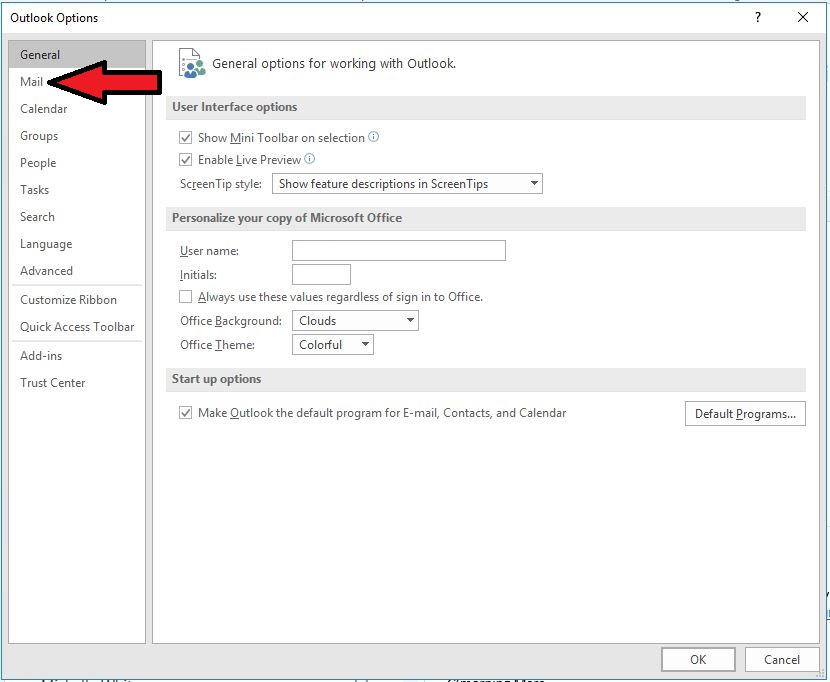

4. Click on the "Signatures" button.

	

5. If you want to **create a new signature**, click "New". Otherwise if you want to edit an existing signature, skip to step 7.

	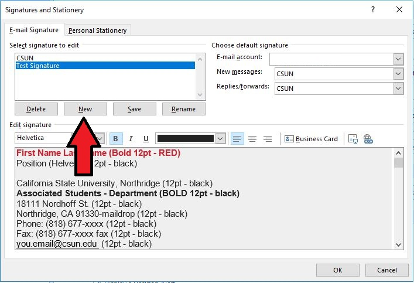

6. Give your new signature a name, then click "OK".

	

7. Select your new or existing signature and edit the text in the text box area. Once you are finished, click "OK".

	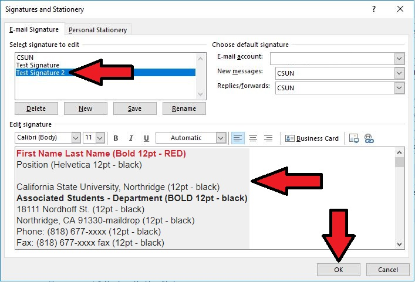

8. Click "OK".

	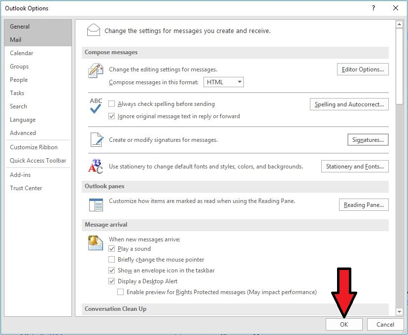

**Via Microsoft Outlook Web Access (Webmail on a Computer)**

1. Log into your Microsoft OWA account. From your inbox, click on the gear in the upper right-hand corner.

	

2. Click on "Mail" in the settings menu that opens.

	

3. Expand "Mail", expand "Layout", and click on "Email Signature".

	

4. Edit your signature in the text box, then click "Save" and click the "back arrow" in the upper-right-hand corner to return to your inbox.

*Note 1: Microsoft OWA only allows for one signature.*

*Note 2: You can check the two boxes (gray arrows) to automatically add your signature to any new emails and replies.*

	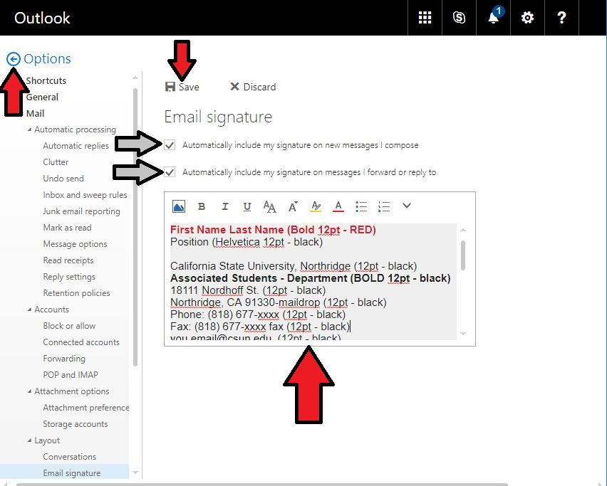

## Reporting Spam Emails
----------------------------
Follow the steps below to report spam emails.

1. Select the spam email

	

2. Open the email as an attachment. Either select "Home" > "More" > "Send as attachment" OR press Control + Alt + F

	

3. Send to "abuse@csun.edu" with a message saying you received said message as spam. Click "Send"

	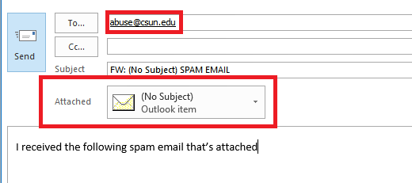

